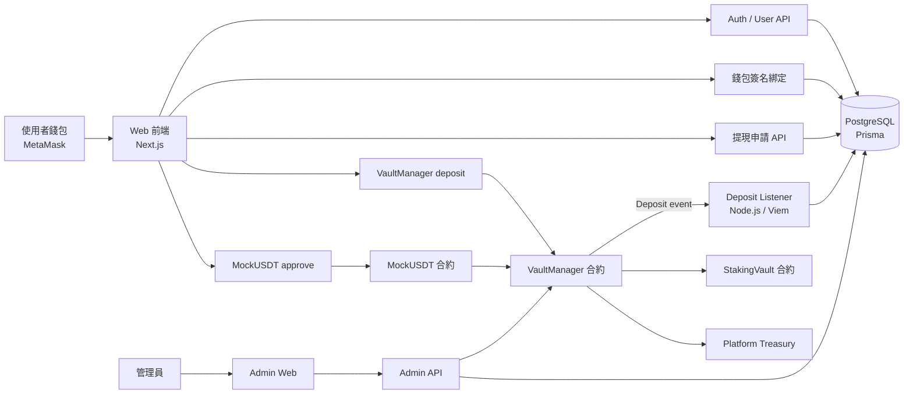

# BSC GameFi & DeFi Telegram Mini App

這是一個結合機率遊戲與投資收益寶的 Web3 平台，專為 Telegram Mini App (TMA) 設計，運行於 Binance Smart Chain (BSC)。

## 目前開發策略

先以 Web 端驗證資金流，確認 BSC Testnet 儲值、listener 入帳、內部餘額、提現申請與 Admin 審核流程穩定後，再回到 Telegram Bot / Telegram Mini App 整合。

## 系統架構與資金流

### 核心資料流
- **錢包綁定：** 前端要求 MetaMask 簽名，後端驗簽後把 wallet address 綁到 `User`。
- **入金：** 使用者先 `approve` MockUSDT，再呼叫 `VaultManager.deposit`；合約發出 `Deposit` event。
- **入帳：** listener 掃到 `Deposit` event 後，依 wallet address 找到已綁定使用者，寫入 `Transaction` 並增加 `User.balanceUsdt`。
- **提現：** 使用者送出提現申請，Admin 審核後由後端呼叫 `VaultManager.executeWithdrawal`。
- **遊戲：** 後續小遊戲不直接碰使用者錢包，而是使用 DB 內部餘額下注與結算。

## 核心機制：以賭養息 (Bet-to-Earn Equilibrium)
- **遊戲盈餘：** 透過 3% 莊家優勢產生。
- **利息補貼：** 90% 遊戲獲利進入獎金池，分配給鎖倉 7 天的投資者。
- **平台收益：** 10% 遊戲獲利作為平台運作費用。

## 技術棧 (Tech Stack)
- **Blockchain:** BSC (Solidity, Hardhat)
- **Frontend:** Next.js, Tailwind CSS (Telegram Mini App UI)
- **Wallet:** WalletConnect / RainbowKit (Supporting BSC)
- **Security:** Chainlink VRF (Randomness)

## 目錄結構
- `/contracts`: 智能合約 (Vault, Games, Staking)
- `/src`: Telegram Mini App 前端代碼
- `/scripts`: 合約部署與腳本測試

## 開發進度
- [x] 專案初始化
- [x] 核心國庫合約 (VaultManager.sol) 開發
- [x] 後端儲值監聽器與 Prisma 帳務模型
- [x] Web MVP dev login、使用者資金流頁與 Admin 真資料後台
- [ ] BSC Testnet 真入金端到端驗證
- [ ] 7 天鎖倉收益寶合約 (StakingVault.sol) 開發
- [ ] 機率遊戲合約 (CoinFlip, Dice) 開發
- [ ] Telegram Mini App 前端介面整合
- [ ] BSC Testnet 部署與測試

## Web MVP 驗證

1. 設定 `.env`：`DATABASE_URL`、`JWT_SECRET`、`ADMIN_TG_ID`、`VAULT_ADDRESS`、`USDT_ADDRESS`。
2. 啟動資料庫初始化：`npm run db:init`。
3. 啟動 web：`npm run dev`。
4. 開啟 `/` 使用 dev login 驗證一般使用者流程。
5. 開啟 `/admin` 使用 dev admin login 驗證提現審核與營運資料。

production 預設不開放 dev login；只有 `NODE_ENV !== "production"` 或 `WEB_MVP_ENABLE_DEV_LOGIN=true` 時可用。
