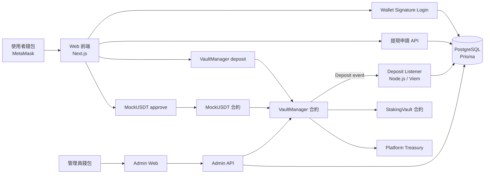

# BSC GameFi & DeFi Web App

這是一個 browser-first 的 Web3 GameFi 與 DeFi 平台，運行於 Binance Smart Chain (BSC)。目前專案方向是純 Web App：使用者透過瀏覽器與 MetaMask 登入、儲值、提現，管理員透過 Web 後台審核營運資料。

## 目前開發策略

先以 Web 端驗證資金流，確認 BSC Testnet 儲值、listener 入帳、內部餘額、提現申請與 Admin 審核流程穩定後，再擴充遊戲與收益寶功能。不要加入聊天機器人或外部訊息平台流程。

## 系統架構與資金流



### 核心資料流
- **登入：** 前端要求 MetaMask 簽署登入訊息，後端驗簽後以 wallet address 建立 session。
- **入金：** 使用者先 `approve` MockUSDT，再呼叫 `VaultManager.deposit`；合約發出 `Deposit` event。
- **入帳：** listener 掃到 `Deposit` event 後，依 wallet address 找到使用者，寫入 `Transaction` 並增加 `User.balanceUsdt`。
- **提現：** 使用者送出提現申請，Admin 審核後由後端呼叫 `VaultManager.executeWithdrawal`。
- **遊戲：** 小遊戲不直接碰使用者錢包，而是使用 DB 內部餘額下注與結算；目前已完成猜硬幣 MVP。

## 核心機制：以賭養息 (Bet-to-Earn Equilibrium)
- **遊戲盈餘：** 透過可設定的長期莊家優勢產生，預設試算值為 3%。
- **三池分配：** 遊戲正利潤可在平台收益、遊戲金庫與收益寶獎金池之間調整；目前 `/simulator` 預設為平台 5%、遊戲金庫 90%、收益寶 5%。
- **利息補貼：** 收益寶鎖倉本金可配置到外部 DeFi、借貸或收益策略產生外部收益；外部收益收入與收益寶獎金池一起分配給鎖倉 7 天的投資者，並受單期收益上限限制。
- **前端試算：** `/simulator` 可用純前端模型壓測三款遊戲、收益寶獎金池、遊戲金庫健康與平台抽成比例，不連錢包、不串合約。

## 技術棧 (Tech Stack)
- **Blockchain:** BSC (Solidity, Hardhat)
- **Frontend:** Next.js, Tailwind CSS
- **Wallet:** MetaMask browser provider, Viem
- **Database:** PostgreSQL, Prisma
- **Security:** Wallet signature session, admin wallet allowlist, Chainlink VRF for future randomness

## 目錄結構
- `/contracts`: 智能合約 (Vault, Games, Staking)
- `/src`: Web 前端與 API routes
- `/server`: listener 與營運服務
- `/scripts`: 合約部署、DB 初始化與驗證腳本

## 開發進度
- [x] 專案初始化
- [x] 核心國庫合約 (VaultManager.sol) 開發
- [x] 後端儲值監聽器與 Prisma 帳務模型
- [x] Web MVP wallet login、使用者資金流頁與 Admin 真資料後台
- [x] 前端池子試算頁，用於比較遊戲流量、三池分配、收益寶資金、提款延遲與平台抽成比例
- [x] 內部餘額遊戲帳務基礎、三池 ledger 與猜硬幣 MVP
- [ ] BSC Testnet 真入金端到端驗證
- [ ] 骰子、幸運轉盤 Web 介面與金庫風控
- [ ] 7 天鎖倉收益寶、浮動分紅、APY cap 與健康監控
- [ ] BSC Testnet 部署與測試

## Web MVP 驗證

### Docker 一鍵啟動

1. 確認 `.env` 已設定 `RPC_URL`、`USDT_ADDRESS`、`VAULT_ADDRESS`、`JWT_SECRET`、`ADMIN_WALLET_ADDRESS`。
2. 啟動前端、listener 與 PostgreSQL：

```bash
npm run docker:up
```

3. 開啟 `http://localhost:3000` 使用一般使用者 Dashboard。
4. listener health check 可看 `http://localhost:3001/healthz`。
5. 查看 web/listener log：

```bash
npm run docker:logs
```

停止服務：

```bash
npm run docker:down
```

Docker Compose 會自動建立本機 PostgreSQL，並把 app container 的 `DATABASE_URL` 指到 `postgres:5432`。如果你想從本機工具連 DB，使用 `localhost:15432`。
若本機 port 已被占用，可在 `.env` 改 `WEB_HOST_PORT`、`LISTENER_HOST_PORT`、`POSTGRES_HOST_PORT`。

### 手動啟動

1. 設定 `.env`：`DATABASE_URL`、`JWT_SECRET`、`ADMIN_WALLET_ADDRESS`、`VAULT_ADDRESS`、`USDT_ADDRESS`。
2. 啟動資料庫初始化：`npm run db:init`。
3. 啟動 web：`npm run dev`。
4. 開啟 `/`，使用 MetaMask 簽名登入一般使用者 Dashboard；此頁包含餘額、儲值/提現、遊戲入口、收益寶入口與近期紀錄。
5. 開啟 `/simulator` 使用純前端試算頁；可調整三款遊戲比例、平台/遊戲金庫/收益寶分配、收益寶資金比例與健康 APY 門檻，觀察池子長期變化。
6. 開啟 `/test` 使用 Debug 工具頁；此頁只保留錢包登入、合約狀態檢查與 MockUSDT 測試充值，正式入金與提現請回 `/` 使用。
7. 使用 `ADMIN_WALLET_ADDRESS` 對應錢包登入後，開啟 `/admin` 驗證提現審核與營運資料。

### 試算驗證

```bash
npm run test:simulator
```

此驗證檢查前端模擬引擎的可重現隨機、長期莊家優勢、收益寶不透支、平台抽成比較、7 天鎖倉到期、提款延遲與 fee sweep 推薦邏輯。

開發階段資料庫可以重建；目前 schema 以 wallet address 作為 `User` 的唯一識別。
